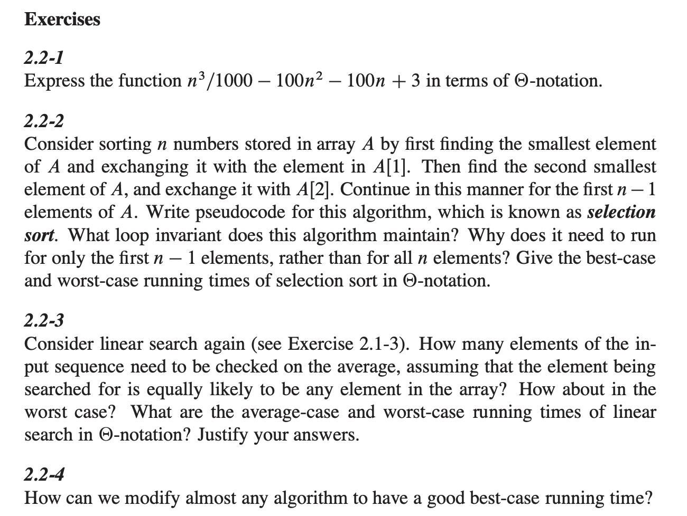

# Running time

```
for( let i = 1; i < A.length ; i++){          
    let current = A[i];                       
    let j = i - 1;                            
    while( j > 0 && A[j] > current ){         
        A[j+1] = A[j];                        
        j--;                                  
    }                        
    A[j+1] = current;                         
}

```


## 2.2-1

O(n^3)

> it is the rate of growth or order of growth, of the running time that really interests us. We therefore consider only the leading term of a formula (e.g., an^2)


## 2.2-2

```javascript
function selectionSort(A) {
    for (let i = 0; i < A.length - 1; i++) {
        let min = i;
        for (let j = i + 1; j < A.length; j++) {
            if (A[j] < A[min]) {
                min = j;
            }
        }

        if (min !== i) {
            let tmp = A[i];
            A[i] = A[min];
            A[min] = tmp;
        }
    }
    return A;
}

console.log(selectionSort([1, 2, 0, 1]));
```


#### Loop invariant

從 `arr` 的第一個 `element` 開始排，經過了 `i` 次排序，前面會有 `i`個從小排到大的元素，因此到了，`i` = `n-1`時前面會有`n-1`個小的元素排序好，自然第 `n` 個就是比 `n-1` 大或等於的元素了, 因爲未來對第`n-1`做正確的排序，會在條件符合下，做交換，因爲第 n 個勢必爲排第 n-1 個交換後的結果。


```
(n-1) + (n-2) + (n-3) + ... + 1 = 1 + ...(n-1) = n(n-1) / 2 = (n^2 - n) / 2
```

`best, worse case `都是  `o(n^2)`


## 2.2-3

每個元素就是答案的機率爲 `1/n`,   跑了`n`次的可能元素的總和爲 `(1 + 2 + 3 + ... + n )` = `( n ( n+ 1)  ) / 2` ，所以答案爲 `1 / n * (( n ( n+ 1)  ) / 2)` =` (n+1) /2`


另一個想法是採取`Best case and worst case`的平均。` best case` 爲第一個元素，`worse case` 爲第 `n` 個元素。所以  `n + 1  / 2 `

`(n + 1)  /  2 =  n * 1/2 + 1/2` 

`Average case`:  run time 還是 `O(n)  `

`Worse case`: `O(n)`


## 2.2-4

design for best case。

