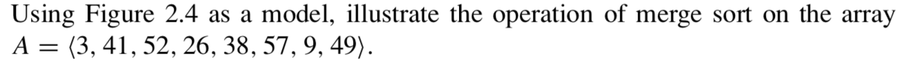
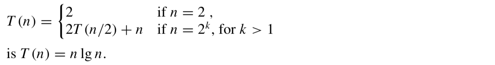
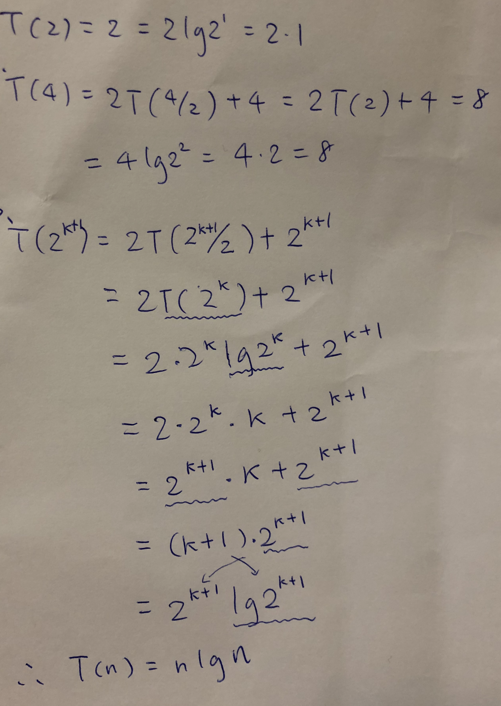

# Week3 2.3 Designing algorithms


## 2.3-1





## 2.3-2

Rewrite the MERGE procedure so that it does not use sentinels, instead stopping
once either array L or R has had all its elements copied back to A and then copying
the remainder of the other array back into A.

```

Merge(A, s, m, e) 

	n1 = m - s + 1
	n2 = e - m
	
	L = [1..n1], R = [1..n2] // new array
	
    for i = 1 to n1
    	L[i] = A[s + i - 1]
    for j = 1 to n2
    	R[j] = A[m + j]
	
	i = j = 1
	k = 1
	
	while i <= n1 && j<= n2
		if L[i] <= R[j]
			A[k] = L[i]
			i++
		else
			A[k] = R[j]
			j++
		k++
	
	while i <= n1
		A[k] = L[i]
		k++
		
	while j <= n2
		A[k] = R[j]
		k++

	
	
```


## 2.3-3

Use mathematical induction to show that when n is an exact power of 2, the solution
of the recurrence






## 2.3-4

Insertion sort can be expressed as a recursive procedure as follows. In order to sort A[1..n],werecursivelysort A[1..n−1]andtheninsert A[n]intothesortedarray A[1 . . n − 1]. Write a recurrence for the running time of this recursive version of insertion sort. 


T(n) = T(n-1) + I(n)

I(n) is equal to steps of running time for insert n elements to sorted list.

```javascript
const insertionSort = (A, n) => {
    if (n <= 1) {
        return;
    }
    insertionSort(A, n - 1);
    let last = A[n - 1];
    let j = n - 2;
    while (j >= 0 && A[j] > last) {
        A[j + 1] = A[j];
        j--;
    }
    A[j + 1] = last;
};
```


## 2.3-5

to be continued.
